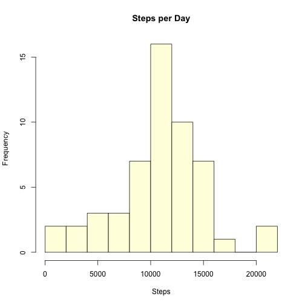
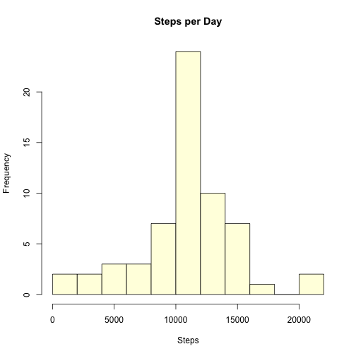
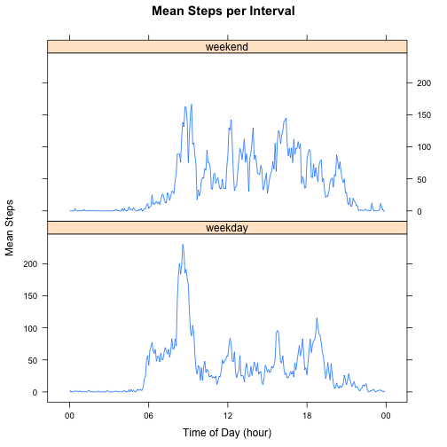

# Reproducible Research: Peer Assessment 1

The assignment involves the processing and analysis of activity data collected from a personal monitoring device.  The data was collected at five minute intervals over a two month period in October and November, 2012.  The data set includes the number of steps taken by the subject during each 5 minute interval. 

## Loading and preprocessing the data

A [zip file][1] with the activity data can be found on the course website.  The [zip file][2] is also available from the GitHub repo associated with this project.

The following code downloads the raw data set, uncompresses it, and reads it into the data frame "activity.data".  If the raw data file is already present locally, then the download process is skipped.  The code creates a log file including the date and time of the download, the md5 checksum of the compressed file, and the source URL.


```r
library(tools)
library(plyr)
```

```
## 
## Attaching package: 'plyr'
## 
## The following object is masked from 'package:lubridate':
## 
##     here
```

```r
library(lattice)
library(scales)

##
##  Define the source data URL and filenames for the zip file, uncompressed data file
##  and log file.
##
activity.url <- "https://d396qusza40orc.cloudfront.net/repdata%2Fdata%2Factivity.zip"
activity.zip <- "activity.zip"
activity.dat <- "activity.csv"
activity.log <- "activity.log"

##
##  If it is not already present, download the source zip file.  If the download
##  fails, display an error message and halt the script.
##
if (!file.exists(activity.dat)) {
    if(download.file(url=activity.url,destfile=activity.zip,method="curl",quiet=TRUE)) {
        stop("Unable to download source data zip file.")
    }
        
    ##
    ##  Create a log entry including a timestamp, the md5 checksum of the zip
    ##  file, and the source URL.  Append the log entry to the specified log file.
    ##
    log.entry <- data.frame(Sys.time(),md5sum(activity.zip),activity.url)
    write.table(log.entry,file=activity.log,append=TRUE,row.names=FALSE,col.names=FALSE)
        
    ##
    ##  Unzip the source data
    ##
    unzip(zipfile=activity.zip)
}
    
##
##  Read the raw activity data into memory
##
activity.data     <- read.csv(activity.dat,stringsAsFactors=FALSE)
observation.count <- nrow (activity.data)
variable.count    <- ncol (activity.data)
variable.names    <- names(activity.data)
```

The raw data set includes `17,568` observations of `3` variables.  The observed variables are `steps, date, interval`.

To simplify time series plotting, the date and interval columns are converted from character strings and integers to a POSIX time class.  In the raw source data, dates are stored as character strings in the format "yyyy-mm-dd".  Intervals are stored as integers in the form "hhmm" with leading zeros suppressed.  Thus the interval "2205" is equal to the time 22:05 or 10:05 PM.  The interval "115" is equal to the time 1:15 AM.  The constinuent date and time elements are converted to a single character string, which is then converted to POSIX time.  The converted POSIX timestamp is stored in a new column called "time.stamp".  A second column is added using just the interval data and a dummy date of 1999-01-01.  This allows intervals to be compared across multiple days and to be plotted as hours and minutes.  This column is called "posix.time".


```r
##
##  Convert the date string and interval integers to POSIX time.  To do this the
##  interval has to be broken into its hour and minute components.  The hours are
##  equal to  interval div 100.  The minutes are equal to interval mod 100.  A
##  time.stamp string is created by appending the date, hours, minutes, and zero
##  seconds.  The time.stamp string is then converted to a POSIX time class.  A
##  second 'posix.interval' is created with the year set to 1999-01-01.  The year
##  value in the posix.interval is ignored in all future processing.
##

hrs  <- activity.data$interval %/% 100
mins <- activity.data$interval %%  100
time.stamp     <- strptime(paste0(activity.data$date," ",hrs,":",mins,":00"),format="%Y-%m-%d %H:%M:%S")
posix.interval <- strptime(paste0("1999-01-01"      ," ",hrs,":",mins,":00"),format="%Y-%m-%d %H:%M:%S")
activity.data <- cbind(activity.data,time.stamp,posix.interval)
```

## What is mean total number of steps taken per day?

Ignoring missing data, plot a histogram of the total number of steps taken each day.  Subsequently calculate and report the mean and median number of steps taken per day.

To accomplish this, all complete observations are extracted from the total data set and the ddply function from the plyr package is used to compute the total number of steps recorded in each remaining day.  The result is used to compute the mean and median values.


```r
##
##  Extract only those rows with complete observations.  Compute the mean steps for each day
##  using ddply.  With the results, compute both the mean and median steps taken across all
##  days.  These values are printed inline below.
##
activity.clean       <- activity.data[complete.cases(activity.data),]
steps.per.day        <- ddply(activity.clean,.(date),summarize,total.steps=sum(steps))
mean.steps.per.day   <- mean(steps.per.day$total.steps)
median.steps.per.day <- median(steps.per.day$total.steps)
```

Create a histogram showing the total number of steps taken each day.


```r
hist(steps.per.day$total.steps,breaks=10,main="Steps per Day",xlab="Steps",ylab="Frequency",col="lightyellow")
```

 

The mean number of steps taken per day is `10,766`.  The median number of steps taken per day is `10,765`.

## What is the average daily activity pattern?

Display a time series plot of the average number of steps taken in each five minute interval, averaged across all days.  Using the cleaned data from the previous step, use the "ddply" function to compute the mean number of steps by interval.  Plot the result.  For reference, include a line that shows the inter-day mean.


```r
##
##  Compute the mean for each interval.  The posix.interval value is used to allow comparison
##  across days (the date portion is set to a single value).  Compute the mean of the results
##  to be used as a reference line on the plot.
##
interval.means <- ddply(activity.clean,.(posix.interval),summarize,mean.steps=mean(steps))
inter.day.mean <- mean(interval.means$mean.steps)

##
##  Convert the posix.interval value to hours of the day in preparation for use as
##  x-axis labels.  Plot the mean.steps against the interval, suppressing the x-axis.
##  Draw a separate x-axis using the hours of the day rather then the raw interval
##  number.  Add a reference line at the inter-day mean.
##
x.values <- as.POSIXct(round(range(interval.means$posix.interval),"hours"))
with(interval.means,plot(mean.steps ~ posix.interval, type="l",xaxt="n",
                         main="Mean Steps per Interval",
                         xlab="Time of Day (hour)",
                         ylab="Mean Steps"))
axis.POSIXct(1,at=seq(x.values[1],x.values[2],by="hour"),format="%H")
abline(h=inter.day.mean,col="blue",lty=2)
```

 

Determine which five minute interval has, on average, the maximum number of steps.


```r
##
##  Select the row that has the maximum value.  Retrieve the interval time and the maximum number
##  of steps.  These values are printed inline, below.
##
max.mean.interval <- interval.means[interval.means$mean.steps == max(interval.means$mean.steps),]
max.interval      <- max.mean.interval$posix.interval
max.steps         <- max.mean.interval$mean.steps
```

The five minute interval with the average maximum number of steps is `08:35` with `206.1698` steps.

## Imputing missing values

Calculate the number of missing values in the source dataset.


```r
##
##  Determine which rows contain complete observations.  The sum of the negation
##  of that list is the count of missing values.  This value is printed inline below.
##
missing.value.count <- sum(!complete.cases(activity.data))
```

Of a total of `17,568` observations, `2,304` are missing values.

Create a new data set that imputes values for the missing data based on the five minute interval means computed above.  For example, if the step count is missing for the interval 11:45 on a particular day, the mean value for 11:45 across all days will be used instead.


```r
##
##  Make a copy of the activity data.  Loop through the copy identifying any missing
##  step values.  Replace the missing values with the mean value for that interval across
##  all days.  The means were computed in the previous step.
##
activity.imputed <- activity.data
for (i in 1:nrow(activity.imputed)) {
    if (is.na(activity.imputed[i,1])) {
        activity.imputed[i,1] <- interval.means[interval.means$posix.interval == activity.imputed[i,5],2]
    }
}
```

Compute the mean and median value for the new data set.  Display a histogram of the data set including the imputed values.


```r
##
##  Compute the total steps per day for each day using the imputed data created above.  With
##  the result, compute the mean and median value across all days.  These values will be printed
##  inline, below.  Draw the histogram.
##
steps.per.day        <- ddply(activity.imputed,.(date),summarize,total.steps=sum(steps))
mean.steps.per.day   <- mean(steps.per.day$total.steps)
median.steps.per.day <- median(steps.per.day$total.steps)
hist(steps.per.day$total.steps,breaks=10,main="Steps per Day",xlab="Steps",ylab="Frequency",col="lightyellow")
```

 

The mean number of steps taken per day is `10,766`.  The median number of steps taken per day is `10,766`

The general shape of the histogram did not change, since the imputed data was based on means drawn from the original data.  The frequencies did increase due to the addition of imputed data for previously incomplete days.  Similarly the mean and median did not change (other than due to rounding) because the imputed data was drawn from the same distribution.

## Are there differences in activity patterns between weekdays and weekends?

Add a factor to the imputed data set indicating whether a sample came from a weekday or a weekend.


```r
##
##  Add a day.type column to the imputed data set and default all values to "weekday".  Then
##  loop through the data set, determining the day of the week for each observation.  If that
##  observation falls on a Sunday or a Saturday, change the day.type to "weekend".  Convert all
##  day.type strings to factors in preparation of making the lattice plot.
##
activity.imputed$day.type <- "weekday"
for (i in 1:nrow(activity.imputed)) {
    if (weekdays(activity.imputed[i,4]) %in% c("Sunday","Saturday")) {
        activity.imputed[i,6] <- "weekend"
    }
}
activity.imputed$day.type <- factor(activity.imputed$day.type)
```

Produce a lattice plot comparing weekend to weekday patterns.


```r
##
##  Compute the interval mean across all values in the imputed data.  As above, extract the hours
##  from the posix.time for later use as x-axis labels
##
interval.means <- ddply(activity.imputed,.(day.type, posix.interval),summarize,mean.steps=mean(steps))
x.values <- as.POSIXct(round(range(interval.means$posix.interval),"hours"))
##
##  Create a stacked lattice plot showing steps by interval, separated by the day.type (weekend or
##  weekday).  Scale the x-axis to display the hour of the day.
##
xyplot(mean.steps ~ posix.interval | day.type, data=interval.means,
       type="l", layout=c(1,2),
       main="Mean Steps per Interval",
       xlab="Time of Day (hour)",
       ylab="Mean Steps",
       scales=list(format="%H"))
```

 

[1]: https://d396qusza40orc.cloudfront.net/repdata%2Fdata%2Factivity.zip "Activity Data - Course Site"
[2]: https://github.com/naterk/RepData_PeerAssessment1/blob/master/activity.zip "Activity Data - Repo"
